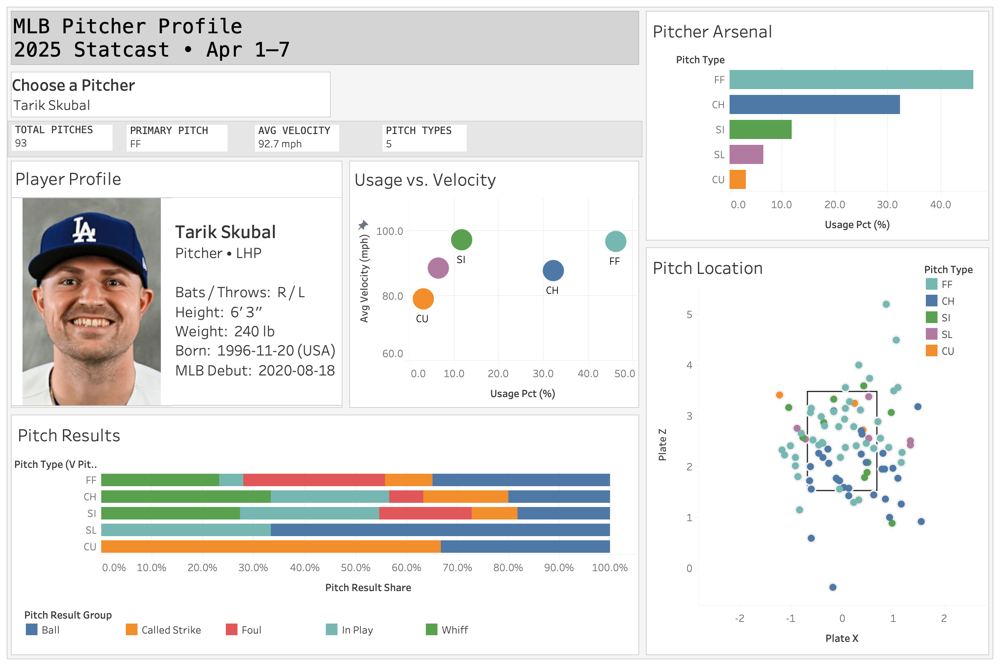

# MLB Pitcher Analytics Dashboard

An end-to-end baseball analytics project that uses **MLB Statcast data, Databricks, PySpark/SQL, and Tableau Desktop** to build an interactive pitcher scouting dashboard.

The project ingests pitch-level Statcast data, transforms it through a Bronze → Silver → Gold pipeline, enriches player profiles using the MLB Stats API, and exposes reporting views used by Tableau.

**25K+ pitches · 399 pitchers · 790 players · Bronze/Silver/Gold pipeline · Interactive Tableau dashboard**

Built on **25K+ pitch-level Statcast records**, covering **790 MLB players** and **399 pitchers**, with the dashboard dynamically updating all KPIs and visualizations for the selected pitcher.



> **Analysis window:** April 1–7, 2025

## Dashboard

The dashboard includes a **pitcher selector that dynamically updates all visualizations and KPIs for the selected pitcher**. Users can explore:

- **Pitcher profile** — player information and headshot
- **KPI summary** — total pitches, primary pitch, average velocity, and number of pitch types
- **Pitcher arsenal** — pitch mix and usage
- **Usage vs. velocity** — relationship between pitch frequency and average velocity
- **Pitch location** — pitch-by-pitch plate location with a strike-zone overlay
- **Pitch results** — outcome distribution by pitch type

The workbook uses a **Tableau extract** for fast dashboard interaction.

A packaged Tableau Desktop workbook is included in the repository:

```text
tableau/MLB_Pitcher_Profile.twbx
```

---

## Architecture

```text
MLB Statcast
     │
     ▼
Bronze
mlb.statcast_bronze
     │
     ▼
Silver
mlb.statcast_silver
     │
     ├──────────────► MLB Stats API
     │                    │
     │                    ▼
     │              mlb.dim_player
     │
     ▼
Gold
├── mlb.pitcher_arsenal_gold
└── mlb.pitcher_summary_gold
     │
     ▼
Tableau reporting views
├── mlb.v_pitcher_arsenal_report
├── mlb.v_pitcher_summary_report
└── mlb.v_pitch_location_report
     │
     ▼
Tableau Desktop Dashboard
```

## Pipeline

### 1. Bronze — raw Statcast ingestion

Pitch-level Statcast data is pulled with `pybaseball.statcast()` and written to:

```text
mlb.statcast_bronze
```

For the current analysis window, the Bronze layer contains **25,477 raw Statcast rows**.

### 2. Silver — dashboard-ready pitch data

The Silver layer selects the fields required downstream, removes rows without a classified `pitch_type`, and creates a stable pitch identifier using:

```text
game_pk + at_bat_number + pitch_number
```

Output:

```text
mlb.statcast_silver
```

The current Silver dataset contains:

- **25,358 classified pitches**
- **25,358 unique pitch IDs**
- **0 missing `plate_x` values**
- **0 missing `plate_z` values**
- **0 missing release-speed values**

### 3. Player enrichment

Pitchers and batters in the Silver dataset are enriched through the MLB Stats API with fields including:

- player name
- position
- handedness
- height and weight
- birth date and country
- MLB debut date
- headshot URL

The current player dimension contains **790 unique players**.

```text
mlb.dim_player
```

### 4. Gold — pitcher arsenal

Pitch-level data is aggregated to one row per pitcher and pitch type.

Metrics include:

- pitch count
- average velocity
- total pitches
- usage percentage

```text
mlb.pitcher_arsenal_gold
```

### 5. Gold — pitcher summary

A one-row-per-pitcher table supports the dashboard KPI cards.

Metrics include:

- total pitches
- primary pitch
- average velocity
- number of pitch types

```text
mlb.pitcher_summary_gold
```

### 6. Tableau reporting views

Three reporting views separate dashboard-facing fields from the underlying transformation tables:

| View | Tableau use |
|---|---|
| `mlb.v_pitcher_summary_report` | KPI cards |
| `mlb.v_pitcher_arsenal_report` | pitcher selector, player profile, arsenal, usage vs. velocity |
| `mlb.v_pitch_location_report` | pitch location and pitch results |

The dashboard currently includes **399 pitchers** with complete profile fields in the reporting layer.

---

## Data Quality Checks

The Databricks notebook includes validation checks for:

- unique pitch identifiers
- Bronze → Silver row counts
- Gold → Silver pitch-count reconciliation
- missing pitch-location coordinates
- missing release velocity
- player-profile enrichment coverage
- pitcher-profile completeness

For the current dataset:

```text
Gold pitch count   = 25,358
Silver pitch count = 25,358
```

All 399 dashboard pitchers have populated profile fields used by the Tableau player-profile view.

> The MLB headshot URL uses MLB's generic-image fallback pattern. A populated URL therefore confirms that a usable image URL exists, not necessarily that every player has a unique portrait.

---

## Repository Structure

```text
mlb-statcast-pitcher-dashboard/
├── README.md
├── 01_ingest_statcast_clean.ipynb
├── MLB_Pitcher_Profile.twbx
└── dashboard.png
```

## Running the Pipeline

### Requirements

- Databricks workspace
- Python
- PySpark
- `pybaseball`
- `pandas`
- `requests`
- Tableau Desktop

The notebook installs `pybaseball` directly:

```python
%pip install pybaseball
```

### Run

1. Import `01_ingest_statcast_clean.ipynb` into Databricks.
2. Attach the notebook to a compute resource.
3. Run the notebook from top to bottom.
4. Confirm the final validation cells pass.
5. Open the Tableau Desktop workbook or connect Tableau to the three reporting views.
6. Create or refresh the Tableau extract.

The analysis dates are controlled by:

```python
START_DATE = "2025-04-01"
END_DATE = "2025-04-07"
```

Change these values to rerun the pipeline for another Statcast window.

---

## Tableau Workbook

The repository includes a packaged Tableau workbook (`.twbx`) so the dashboard can be reviewed locally in Tableau Desktop.

The workbook contains the dashboard layout and Tableau extract used for the current project version.

If Tableau Desktop is not available, the exported dashboard image in `images/dashboard.png` provides a static preview of the final dashboard.

---

## Technologies

- **Databricks**
- **PySpark**
- **Spark SQL**
- **Python**
- **pybaseball / Statcast**
- **MLB Stats API**
- **Tableau Desktop**

## Project Goals

This project was built to demonstrate an end-to-end analytics workflow rather than only a visualization:

- ingest external sports data
- design layered analytical tables
- validate data quality
- enrich records through an API
- create reusable reporting views
- model related datasets in Tableau
- build an interactive analytical dashboard
- optimize dashboard responsiveness using extracts

## Future Improvements

Possible extensions include:

- expanding the analysis window to a full month or season
- adding a global date-range filter
- comparing pitchers across time periods
- adding batter-handedness splits
- incorporating movement, spin rate, or expected outcome metrics
- automating scheduled data refreshes

---

## Data Sources

- MLB Statcast data accessed through `pybaseball`
- Player metadata from the MLB Stats API
- Player headshots from MLB static image URLs

This project is intended for educational and portfolio use.
